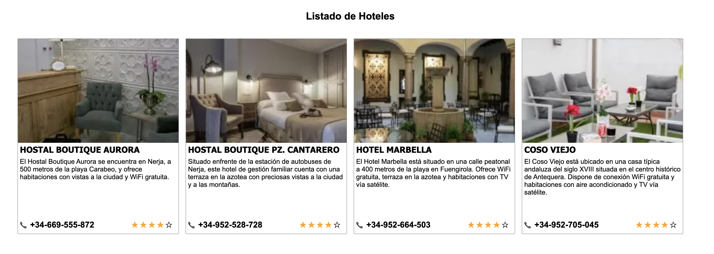

# Bootcamp JavaScript 2022

## Práctica Módulo 0:

En esta práctica se incluye el HTML y el CSS con un listado de hoteles incluyendo las imágenes y la información de los hoteles tales como el nombre, descripción, teléfono de contacto, y valoración.




La estructura de directorios es la siguiente:


```
src/
├─ css/                                 # Estilos CSS
│  ├─ site.css
├─ img/                                 # Recursos de imágenes
│  ├─ hotel-boutique-aurora.jpeg
│  ├─ hotel-boutique-cantarero.jpeg
│  ├─ hotel-coso-viejo.jpeg/
│  ├─ hotel-marbella.jpeg
├─ index.html                           # Archivo con el contenido HTML
```


Fuente documental:

Las imágenes han sido extraídas de la web de Booking.com


