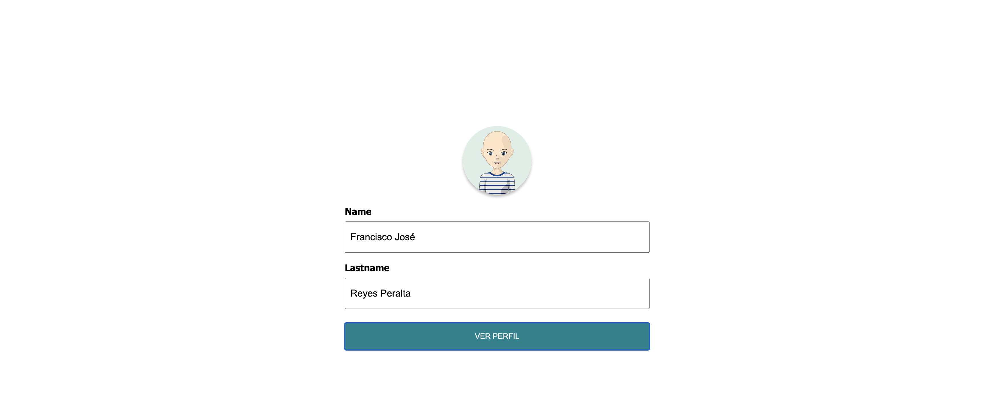

# Bootcamp JavaScript 2022

## Práctica Módulo 1:

En esta práctica se incluye el HTML, el CSS y el archivo de JavaScript con un formulario interactivo donde pulsando sobre el botón se puede ver por la consola el valor de los campos poblados vía JavaScript.





La estructura de directorios es la siguiente:


```
src/
├─ css/                                 # Estilos CSS
│  ├─ site.css
├─ js/                                  # Scripts de JavaScript
│  ├─ site.js
├─ img/                                 # Recursos de imágenes
│  ├─ avatar.jpeg
├─ index.html                           # Archivo con el contenido HTML
```
