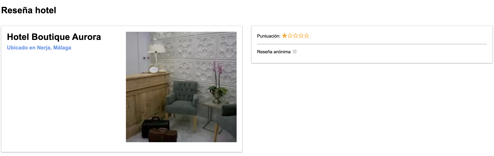

# Bootcamp JavaScript 2022

## Práctica Módulo 2:

En esta práctica se incluye el HTML, el CSS y el archivo de JavaScript, así como las imagenes necesarias para realizar el formulario de Reseña de Hotel.





La estructura de directorios es la siguiente:


```
src/
├─ css/                                 # Estilos CSS
│  ├─ styles.css
├─ js/                                  # Scripts de JavaScript
│  ├─ app.js
├─ img/                                 # Recursos de imágenes
│  ├─ hotel-boutique-aurora.jpeg
│  ├─ hotel-boutique-cantarero.jpeg
│  ├─ hotel-coso-viejo.jpeg
│  ├─ hotel-marbella.jpeg
├─ index.html                           # Archivo con el contenido HTML
```
