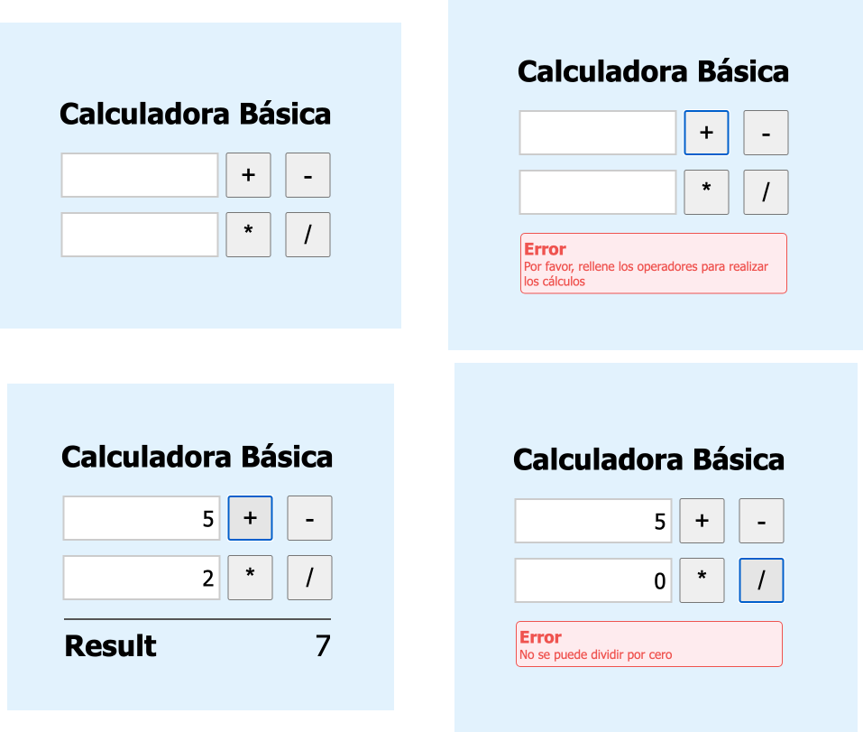

# Bootcamp JavaScript 2022

## Práctica Módulo 4:

En esta práctica se incluye el HTML y el archivo de JavaScript, para realizar las prácticas sobre funciones y eventos.




La estructura de directorios es la siguiente:

```
src/
├─ excersise-1                           # Laboratorio 1 - Calculadora JS
├─ excersise-2                           # Laboratorio 2 - Calculadora HTLM - JS
```

